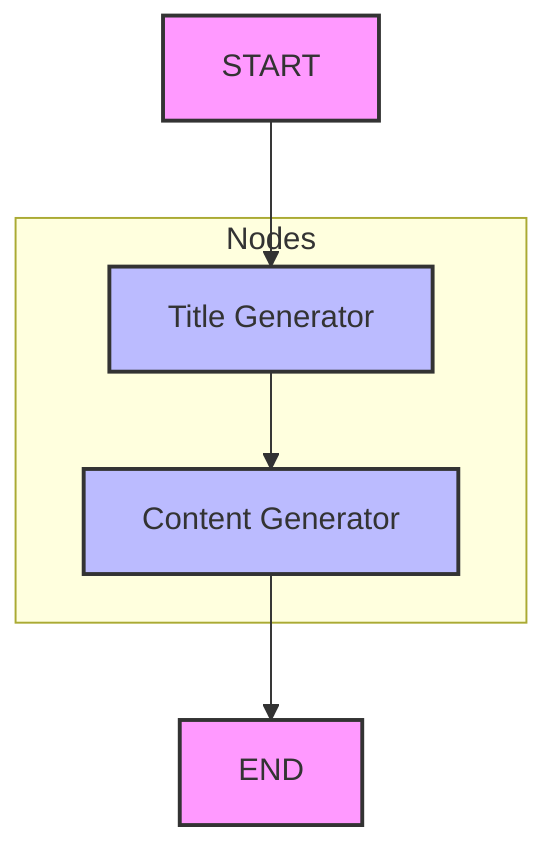

# Agentic Blog Generator 🤖📝

An intelligent, multi-step blog content generation system built with **FastAPI**, **LangGraph**, and **Groq (Llama 3.1)**. This project demonstrates an agentic workflow where different nodes in a graph handle specific tasks like title generation and content creation, ensuring a structured and high-quality output.

---

## 🚀 Features

- **Agentic Workflow**: Uses LangGraph to orchestrate a stateful blog generation process.
- **FastAPI Integration**: Provides a robust REST API for seamless integration with UIs or testing tools like Postman.
- **Multi-language Support**: Generate high-quality blog posts in various languages (e.g., Telugu, English, Spanish).
- **High Performance**: Powered by Groq's Llama 3.1 8B model for lightning-fast inference.
- **Stateful Management**: Tracks the progress of the generation through a predefined state schema.

---

## 🔄 Workflow Diagram

The system follows a linear state graph orchestrated by LangGraph:



1. **START**: Entry point with user `topic` and `language`.
2. **Title Generator**: Creates an engaging title based on the topic.
3. **Content Generator**: Generates the main body using the generated title and initial topic.
4. **END**: Returns the final state containing the title and content.

---

## 🛠️ Tech Stack

- **Backend**: FastAPI
- **LLM Framework**: LangChain & LangGraph
- **LLM Provider**: Groq (Llama 3.1)
- **State Management**: Pydantic & TypedDict
- **Environment Management**: Python-dotenv
- **Server**: Uvicorn

---

## 📂 Project Structure

```text
Agentic_Blog_Generator/
├── src/
│   ├── graphs/         # LangGraph workflow definitions
│   ├── nodes/          # Task-specific functions (Title/Content generator)
│   ├── states/         # State schemas for the graph
│   └── llms/           # Model configuration (Groq)
├── app.py              # FastAPI entry point
├── requirements.txt    # Project dependencies
└── .env                # API Keys and configuration
```

---

## ⚙️ Setup & Installation

### 1. Clone the repository
```bash
git clone <repository-url>
cd Agentic_Blog_Generator
```

### 2. Create a Virtual Environment
```bash
python -m venv venv
source venv/bin/activate  # On Windows: venv\Scripts\activate
```

### 3. Install Dependencies
```bash
pip install -r requirements.txt
```

### 4. Configure Environment Variables
Create a `.env` file in the root directory and add your Groq API key:
```env
GROQ_API_KEY=your_groq_api_key_here
LANGCHAIN_API_KEY=your_langsmith_key_optional
```

---

## 🏃 Running the Application

To start the FastAPI server:
```bash
python app.py
```
The server will be available at `http://localhost:8000`.

---

## 🧪 Testing with Postman

You can test the API by sending a `POST` request to the `/blog_content` endpoint.

### Request Body (JSON)
```json
{
    "topic": "The future of Agentic AI",
    "language": "English"
}
```

### Example Response
```json
{
    "data": {
        "topic": "The future of Agentic AI",
        "language": "English",
        "blog": {
            "title": "Unleashing the Matrix: Why Agentic AI is the Next Frontier",
            "content": "Full blog content generated here..."
        }
    },
    "status": 200,
    "message": "Blog content generated successfully"
}
```

---

## 🌟 Future Enhancements
- [ ] Integration with a Streamlit or React frontend.
- [ ] SEO Keyword optimization node.
- [ ] Image generation node for blog banners.
- [ ] Direct publishing to platforms like Medium or Hashnode.

---

## 🤝 Contributing
Feel free to fork this repository and submit pull requests for any improvements!

---

## 📝 License
This project is licensed under the MIT License.
